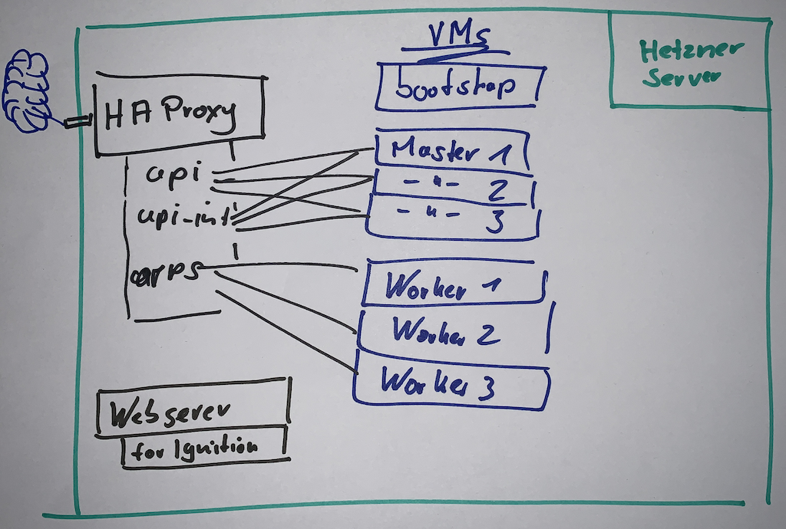
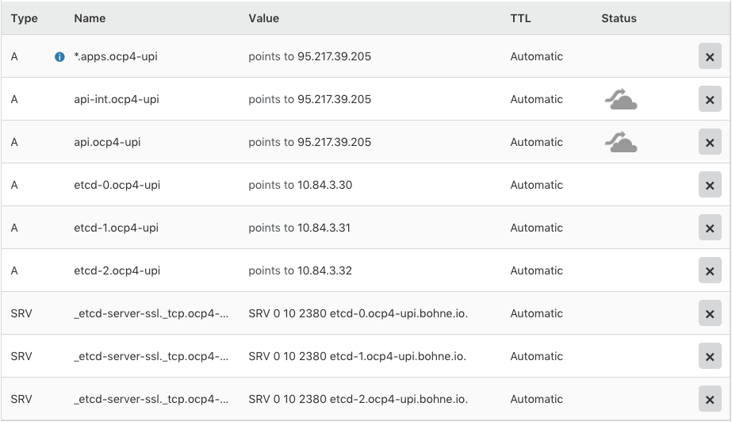

# OpenShift 4 UPI installation on libvirt
ifdef::env-github[]
:imagesdir:
 https://gist.githubusercontent.com/path/to/gist/revision/dir/with/all/images
:tip-caption: :bulb:
:note-caption: :information_source:
:important-caption: :heavy_exclamation_mark:
:caution-caption: :fire:
:warning-caption: :warning:
endif::[]
ifndef::env-github[]
:imagesdir: ./
endif::[]
:toc:
:toc-placement!:

CAUTION: This is a stupid bunch of informations for my self

toc::[]

## Links to various documentations
* https://libvirt.org/formatnetwork.html[Libvirt Network XML doc]
* https://libvirt.org/formatdomain.html[Libvirt Domain XML doc]
* https://docs.openshift.com/container-platform/4.1/installing/installing_bare_metal/installing-bare-metal.html[OpenShift 4.1 docs]
* https://mirror.openshift.com/pub/openshift-v4/dependencies/rhcos/4.1/4.1.0-rc.3/[OpenShift 4.1 resources]
* https://openshift-release-artifacts.svc.ci.openshift.org/4.1.0-rc.3/[OpenShift 4.1 Installer and Client] 
* https://kcli.readthedocs.io/[KCLI Docs]
* https://github.com/coreos/coreos-installer[Upstream Installer]
* http://post-office.corp.redhat.com/archives/openshiftbeta/2019-May/msg00000.html[Red Hat Enterprise Linux CoreOS Eval Guide.pdf (Attachment)]

## Known problems

* Image registry has no storage
** S3 works only on AWS or GCE 

## Enviroment

### DNS
----
api-int.ocp4-upi.bohne.io	A	95.217.39.205
api.ocp4-upi.bohne.io	A	95.217.39.205
*.apps.ocp4-upi.bohne.io	A	95.217.39.205
etcd-0.ocp4-upi.bohne.io	A	10.84.3.30
etcd-1.ocp4-upi.bohne.io	A	10.84.3.31
etcd-2.ocp4-upi.bohne.io	A	10.84.3.32
_etcd-server-ssl._tcp.ocp4-upi.bohne.io	SRV	10\t2380\tetcd-0.ocp4-upi.bohne.io
_etcd-server-ssl._tcp.ocp4-upi.bohne.io	SRV	10\t2380\tetcd-1.ocp4-upi.bohne.io
_etcd-server-ssl._tcp.ocp4-upi.bohne.io	SRV	10\t2380\tetcd-2.ocp4-upi.bohne.io
---- 

### Haproxy

[source,config]
----
# OCP4 UPI
frontend ocp4-upi-6443
    bind 95.217.39.205:6443
    mode tcp
    option tcplog
    default_backend ocp4-upi-6443
backend ocp4-upi-6443
    balance source
    mode tcp
    server      bootstrap 10.84.3.2:6443 check
    server      controller-0 10.84.3.30:6443 check
    server      controller-1 10.84.3.31:6443 check
    server      controller-2 10.84.3.32:6443 check

frontend ocp4-upi-22623
    bind 95.217.39.205:22623
    mode tcp
    option tcplog
    default_backend ocp4-upi-22623
backend ocp4-upi-22623
    balance source
    mode tcp
    server      bootstrap 10.84.3.2:22623 check
    server      controller-0 10.84.3.30:22623 check
    server      controller-1 10.84.3.31:22623 check
    server      controller-2 10.84.3.32:22623 check

frontend ocp4-upi-443
    bind 95.217.39.205:443
    mode tcp
    option tcplog
    default_backend ocp4-upi-443
backend ocp4-upi-443
    balance source
    mode tcp
    server      worker-0 10.84.3.40:443 check
    server      worker-1 10.84.3.41:443 check
    server      worker-2 10.84.3.42:443 check

frontend ocp4-upi-80
    bind 95.217.39.205:80
    mode tcp
    option tcplog
    default_backend ocp4-upi-80
backend ocp4-upi-80
    balance source
    mode tcp
    server      worker-0 10.84.3.40:80 check
    server      worker-1 10.84.3.41:80 check
    server      worker-2 10.84.3.42:80 check
----

### SELinux
----
$ semanage port -l | grep http_port_t
http_port_t                    tcp      1984, 6443, 80, 81, 443, 488, 8008, 8009, 8443, 9000
$ semanage port -a -t http_port_t -p tcp 22623
----

### Create letsencrypt certificates

    export CLOUDFLARE_ACCOUNT_EMAIL=sadf@example.com
    export CLOUDFLARE_ACCOUNT_API_TOKEN=asdf
    export CLOUDFLARE_ZONE="exmaple.com"

    ./00_letsencrypt_with_cloudflare.yml -e public_hostname=ocp4-upi.bohne.io

## Deployment

Prereq:

 * Download installer, pullsecret, iso and bios from cloud.redhat.com
 * Prepare Webserver for iso, bios and ignition
 * Adjust domain in kcli.yml and install-config.yaml

.Deployment

. Create install-config.yaml

  mkdir installer-config/
  cp install-config.yaml-without-secret installer-config/install-config.yaml
  vi installer-config/install-config.yaml

. Create ignition config

  # openshift-install create ignition-configs  --log-level debug --dir=installer-config/
  INFO Consuming "Install Config" from target directory

. Create igntion config for every host and add static ip adress

  # ./update-ign.sh
  Write /var/www/html/ocp4/bootstrap-0.ign
  Write /var/www/html/ocp4/master-[0:2].ign
  Write /var/www/html/ocp4/worker-[0:2].ign
  
. Create virtual machines 
  
  kcli plan -f kcli.yml ocp4-upi

. Paste ignition config to every machine
.. Bootstrap: 

  virsh console bootstrap.ocp4-upi.bohne.io
  <TAB><SPACE> Insert:
  ip=dhcp console=tty0 console=ttyS0 coreos.inst.install_dev=vda  coreos.inst.image_url=http://ds.bohne.io/ocp4/rhcos-4.1.0-x86_64-metal-bios.raw.gz coreos.inst.ignition_url=http://ds.bohne.io/ocp4/bootstrap-0.ign

.. Master 0-2

  virsh console controller-0.ocp4-upi.bohne.io
  <TAB><SPACE> Insert:
  ip=dhcp console=tty0 console=ttyS0 coreos.inst.install_dev=vda  coreos.inst.image_url=http://ds.bohne.io/ocp4/rhcos-4.1.0-x86_64-metal-bios.raw.gz  coreos.inst.ignition_url=http://ds.bohne.io/ocp4/master-0.ign
  
  virsh console controller-1.ocp4-upi.bohne.io
  <TAB><SPACE> Insert:
  ip=dhcp console=tty0 console=ttyS0 coreos.inst.install_dev=vda  coreos.inst.image_url=http://ds.bohne.io/ocp4/rhcos-4.1.0-x86_64-metal-bios.raw.gz  coreos.inst.ignition_url=http://ds.bohne.io/ocp4/master-1.ign

  virsh console controller-2.ocp4-upi.bohne.io
  <TAB><SPACE> Insert:
  ip=dhcp console=tty0 console=ttyS0 coreos.inst.install_dev=vda  coreos.inst.image_url=http://ds.bohne.io/ocp4/rhcos-4.1.0-x86_64-metal-bios.raw.gz  coreos.inst.ignition_url=http://ds.bohne.io/ocp4/master-2.ign

.. Worker 0-2

  virsh console worker-0.ocp4-upi.bohne.io
  <TAB><SPACE> Insert:
  ip=dhcp console=tty0 console=ttyS0 coreos.inst.install_dev=vda  coreos.inst.image_url=http://ds.bohne.io/ocp4/rhcos-4.1.0-x86_64-metal-bios.raw.gz  coreos.inst.ignition_url=http://ds.bohne.io/ocp4/worker-0.ign
  
  virsh console worker-1.ocp4-upi.bohne.io
  <TAB><SPACE> Insert:
  ip=dhcp console=tty0 console=ttyS0 coreos.inst.install_dev=vda  coreos.inst.image_url=http://ds.bohne.io/ocp4/rhcos-4.1.0-x86_64-metal-bios.raw.gz  coreos.inst.ignition_url=http://ds.bohne.io/ocp4/worker-1.ign

  virsh console worker-2.ocp4-upi.bohne.io
  <TAB><SPACE> Insert:
  ip=dhcp console=tty0 console=ttyS0 coreos.inst.install_dev=vda  coreos.inst.image_url=http://ds.bohne.io/ocp4/rhcos-4.1.0-x86_64-metal-bios.raw.gz  coreos.inst.ignition_url=http://ds.bohne.io/ocp4/worker-2.ign

. Wait for bootstrap complete

  $ openshift-install wait-for bootstrap-complete --log-level=debug --dir=installer-config
  DEBUG OpenShift Installer unreleased-master-980-g4efeb0c6777189e0f2571d82c12386780b14ef44
  DEBUG Built from commit 4efeb0c6777189e0f2571d82c12386780b14ef44
  INFO Waiting up to 30m0s for the Kubernetes API at https://api.ocp4-upi.bohne.io:6443...
  DEBUG Still waiting for the Kubernetes API: Get https://api.ocp4-upi.bohne.io:6443/version?timeout=32s: EOF
  DEBUG Still waiting for the Kubernetes API: the server could not find the requested resource
  DEBUG Still waiting for the Kubernetes API: the server could not find the requested resource
  DEBUG Still waiting for the Kubernetes API: the server could not find the requested resource
  DEBUG Still waiting for the Kubernetes API: the server could not find the requested resource
  DEBUG Still waiting for the Kubernetes API: the server could not find the requested resource
  DEBUG Still waiting for the Kubernetes API: Get https://api.ocp4-upi.bohne.io:6443/version?timeout=32s: EOF
  INFO API v1.13.4+838b4fa up
  INFO Waiting up to 30m0s for bootstrapping to complete...
  DEBUG Bootstrap status: complete
  INFO It is now safe to remove the bootstrap resources

. Destroy bootstrap

  # virsh destroy bootstrap.ocp4-upi.bohne.io

. Wait for install complete

  # openshift-install wait-for install-complete --log-level=debug --dir=installer-config
  DEBUG OpenShift Installer unreleased-master-980-g4efeb0c6777189e0f2571d82c12386780b14ef44
  DEBUG Built from commit 4efeb0c6777189e0f2571d82c12386780b14ef44
  INFO Waiting up to 30m0s for the cluster at https://api.ocp4-upi.bohne.io:6443 to initialize...
  DEBUG Still waiting for the cluster to initialize: Working towards 4.1.0: 96% complete
  DEBUG Still waiting for the cluster to initialize: Working towards 4.1.0: 97% complete, waiting on authentication, image-registry, monitoring, openshift-samples
  DEBUG Still waiting for the cluster to initialize: Working towards 4.1.0: 97% complete
  DEBUG Still waiting for the cluster to initialize: Working towards 4.1.0: 97% complete
  DEBUG Still waiting for the cluster to initialize: Working towards 4.1.0: 98% complete, waiting on image-registry, openshift-samples
  DEBUG Still waiting for the cluster to initialize: Some cluster operators are still updating: image-registry, openshift-samples
  DEBUG Still waiting for the cluster to initialize: Working towards 4.1.0: 98% complete
  DEBUG Still waiting for the cluster to initialize: Working towards 4.1.0: 99% complete
  DEBUG Still waiting for the cluster to initialize: Working towards 4.1.0: 100% complete, waiting on image-registry

. Login into cluster

  export KUBECONFIG=installer-config/auth/kubeconfig
  oc get pods -A

  open https://console-openshift-console.apps.ocp4-upi.bohne.io

. *Optional* Deployn letsencrypt certificates
+
    oc create secret tls router-certs --cert=certificates/ocp4-upi.bohne.io/fullchain.crt --key=certificates/ocp4-upi.bohne.io/cert.key -n openshift-ingress

    oc patch ingresscontroller default -n openshift-ingress-operator --type=merge --patch='{"spec": { "defaultCertificate": { "name": "router-certs" }}}'

+
https://blog.openshift.com/requesting-and-installing-lets-encrypt-certificates-for-openshift-4/[Source]

. *Optional* Set emptyDir as registry storage
+
    oc patch configs.imageregistry.operator.openshift.io cluster --type merge --patch '{"spec":{"storage":{"emptyDir":{}}}}'

## Hackspace

----
# Static ip stuff
# Don't use `--slurpfile` because of https://github.com/stedolan/jq/issues/1908

cat bootstrap.ign | jq ".storage.files |= . + $(./static-ip.sh bootstrap.ocp4-upi.bohne.io 10.84.3.2)"  -c > /var/www/html/ocp4/bootstrap-static-ip.ign
----

## PXE Example - not testet yet

Maybe PXE boot is an good solution to automate the ignition stuff

----

[root@master Q-openstack]# cat ocp4-1.cfg 
PROMPT 0
TIMEOUT 100
SERIAL 0 115200

SAY ocp4-nvme kickstart install
SAY .
SAY DEFAULT is ocp4-http
DEFAULT ocp4-http

LABEL ocp4-http
   SAY ocp4-http:  Boot to ocp4 method using http
   KERNEL http://repo/repo/ocp4/rhcos-410.8.20190425.1-installer-kernel
   APPEND ip=dhcp rd.neednet=1 initrd=http://repo/repo/ocp4/rhcos-410.8.20190425.1-installer-initramfs.img console=ttyS0,115200n8 inst.sshd=1 coreos.inst=yes coreos.inst.install_dev=nvme1n1 coreos.inst.image_url=http://repo/repo/ocp4/rhcos-410.8.20190425.1-metal-bios.raw coreos.inst.ignition_url=http://repo/repo/ocp4/boostrap.ign
----

Source: https://coreos.slack.com/archives/C999USB0D/p1556627876298900